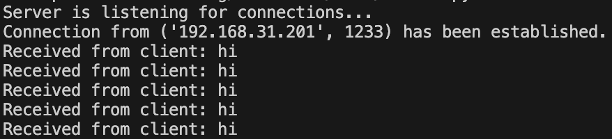
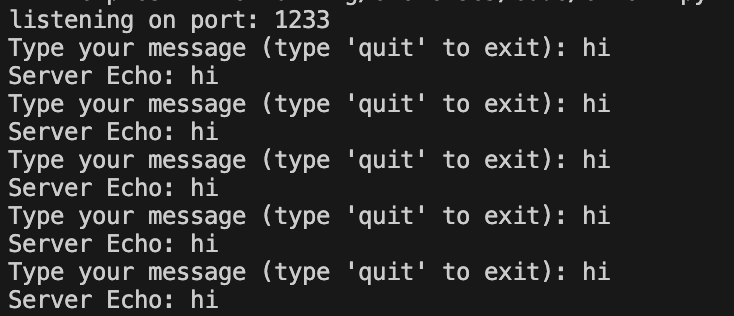
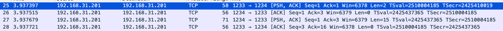
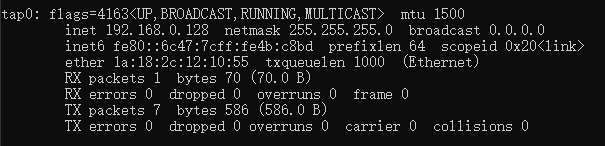
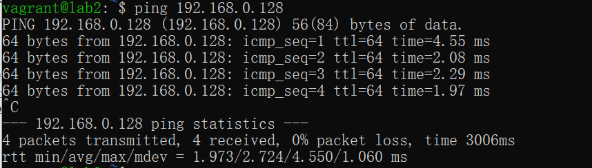
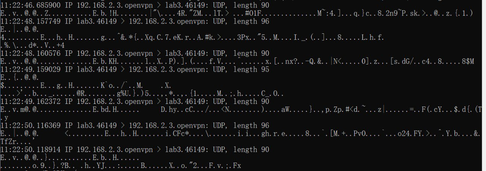

# Exercise 5 Ipsec & VPN

Ziqi Wang 101699682
Ilmari Hämäläinen 894931

## 1. Server and client setup

We let our server listen to the `1234` port on the ip address and the client connect to the server.

`server.py`

```python
import socket

def handle_client(client_socket):
    while True:
        message = client_socket.recv(1024).decode('utf-8')
        if not message:
            break
        print(f"Received from client: {message}")
        client_socket.send(f"Server Echo: {message}".encode('utf-8'))
    client_socket.close()

server_socket = socket.socket(socket.AF_INET, socket.SOCK_STREAM)
server_socket.bind((server_ip, 1234))
server_socket.listen()
print("Server is listening for connections...")

while True:
    client_socket, address = server_socket.accept()
    print(f"Connection from {address} has been established.")
    handle_client(client_socket)
```

`client.py`

```python
import socket

client_socket = socket.socket(socket.AF_INET, socket.SOCK_STREAM)
client_socket.bind(('localhost', 1233))
client_socket.connect((server_ip, 1234))
print('listening on port:', client_socket.getsockname()[1])

try:
    while True:
        message = input("Type your message (type 'quit' to exit): ")
        if message.lower() == 'quit':
            break
        client_socket.send(message.encode('utf-8'))
        response = client_socket.recv(1024).decode('utf-8')
        print(response)
finally:
    client_socket.close()
```


*Figure 1.1 server response*


*Figure 1.2 client interface*

## 2. Wireshark package capturing without VPN

When I sent a message to the server, I captured these following packages

Packet 25: The client or server is sending data (PSH, ACK) to the other party. The sequence number is 1, and the acknowledgment number is 1, which means it's expecting data starting with byte 1 in the next packet from the other side.

Packet 26: This packet is acknowledging (ACK) the receipt of data. It's not pushing any data itself, as indicated by the length of 0.

Packet 27: Similar to packet 25, this is sending data (PSH, ACK) and also acknowledging receipt of data from the other party.

Packet 28: Another acknowledgment packet, similar to packet 26.


Figure 2.1 wireshark_novpn

## 3. Setting up VPN

This assignment involves three virtual machines(Ubuntu)
On lab1 (GW):

```text
192.168.0.2 enp0s8
192.168.2.2 enp0s9
```

On lab2 (SS):

```text
192.168.0.3/24 enp0s8
```

On lab3 (RW):

```text
192.168.2.3/24 enp0s8
```

### 3.1 Setting up a PKI (Public Key Infrastructure)

install openvpn and easyrsa

```shell
sudo apt update
sudo apt install easy-rsa
```

Copy the Easy-RSA template files into this directory

```shell
make-cadir ~/openvpn-ca
cd ~/openvpn-ca
```

edit `vars` file in `~/openvpn-ca`

```shell
set_var EASYRSA_REQ_COUNTRY    "FI"
set_var EASYRSA_REQ_PROVINCE   "Capital"
set_var EASYRSA_REQ_CITY       "Espoo"
set_var EASYRSA_REQ_ORG        "Copyleft Certificate Co"
set_var EASYRSA_REQ_EMAIL      "vagrant@lab1.com"
set_var EASYRSA_REQ_OU         "Aalto University"
```

Build Certificate Authority(CA)

```shell
cd ~/openvpn-ca
./easyrsa init-pki
./easyrsa build-ca
```

Generate the Server Certificate and Key

```shell
cd ~/openvpn-ca
./easyrsa gen-req server nopass
./easyrsa sign-req server server
```

Generate Client Certificate and Key

```shell
cd ~/openvpn-ca
./easyrsa gen-req client1 nopass
./easyrsa sign-req client client1
```

Generate Diffie-Hellman Parameters

```shell
cd ~/openvpn-ca
./easyrsa gen-dh
```

Copy these files to server

ca.crt
server.crt
server.key
dh.pem (Diffie-Hellman file, might be named dh2048.pem or similar)

Copy these files to client

ca.crt
client1.crt
client1.key

### 3.2 Configure OpenVPN

For bridge setup:

Copy the `/usr/share/doc/openvpn/examples/sample-scripts/bridge_start` and `/usr/share/doc/openvpn/examples/sample-scripts/bridge_stop` to `/etc/openvpn`

Edit `bridge_start`

```text
# Define Bridge Interface
br="br0"

# Define list of TAP interfaces to be bridged,
# for example tap="tap0 tap1 tap2".
tap="tap0"

# Define physical ethernet interface to be bridged
# with TAP interface(s) above.
eth="enp0s8"
eth_ip="192.168.0.3"
eth_netmask="255.255.255.0"
eth_broadcast="192.168.0.255"

...
rest reamains the same
```

Edit `bridge_stop`

```text
# Define Bridge Interface
br="br0"

# Define list of TAP interfaces to be bridged together
tap="tap0"

ifconfig $br down
brctl delbr $br

for t in $tap; do
    openvpn --rmtun --dev $t
done
```

Copy `/usr/share/doc/openvpn/examples/sample-config-files/server.conf` to `/etc/openvpn` and edit it.

- Comment out the line which says dev tun and replace it instead with `dev tap0`
- Comment out the line that begins with server and replace it with `server-bridge 192.168.0.4 255.255.255.0 192.168.0.128 192.168.0.254`

Now start the Openvpn service on both client and server using `sudo systemctl start openvpn`. We can see a new tap device is in use on lab3(client).


*Figure 3.1 `tap` device*

Now lab3 and lab3 seem to be in the same network(Fig 3.2)



## 4. Package Capturing

Open the socket server on lab2 and client on lab3. Since we are using headless virtual machine, we decided to use `sudo tcpdump -i enp0s8 -A` with the `-A` flag to print package in ASCII. As you can see in Fig 4.1, messages are sent to the destination encrypted through vpn.


*Figure 4.1 `tcpdump` capturing result*

In summary, this `tcpdump` output shows UDP packets being sent from lab2 to lab3 on port 46149. The traffic is encrypted (as indicated by the non-plaintext payload).

## 5. Conclusion

This report has outlined the process of setting up a secure communication channel between a server and a client using a VPN (Virtual Private Network) built with OpenVPN and IPsec protocols. The steps involved setting up the server and client applications, analyzing packet transmissions without VPN using Wireshark, and then configuring a VPN environment using OpenVPN in a simulated network with three virtual machines.

The initial setup involved a simple Python server-client model where the server listened on port 1234 and the client connected to this server. The communication was unencrypted, and packet analysis using Wireshark revealed the plaintext data exchange between the server and the client, making it vulnerable to eavesdropping.

To secure the communication, a VPN was set up using OpenVPN. The process involved creating a Public Key Infrastructure (PKI) with EasyRSA, generating certificates and keys for the server and clients, and configuring OpenVPN to use these credentials for encrypted communication. The network was configured with a bridge interface to seamlessly integrate the VPN into the existing network infrastructure.

The impact of the VPN on the network communication was analyzed using tcpdump, which showed that data packets between the server and client were now encrypted, ensuring privacy and security of the data in transit. This demonstrated the effectiveness of the VPN in protecting communication against potential network threats and eavesdropping.

In conclusion, the implementation of a VPN using OpenVPN and IPsec protocols has been shown to significantly enhance the security of network communications between a server and a client. The setup process, though intricate, is a valuable investment in securing data transmissions, especially in environments where sensitive information is exchanged over potentially insecure networks.
